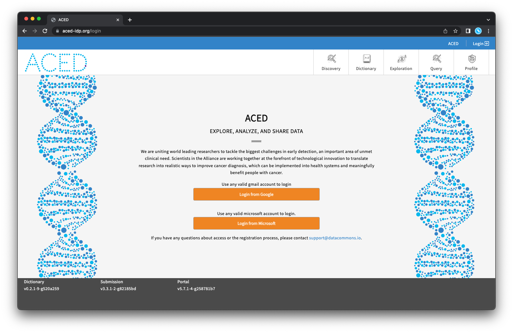

# Documentation Site for the ACED Data Commons

This mkdocs-based codebase deploys documentation to [aced-idp.github.io](https://aced-idp.github.io)

<a href="https://aced-idp.github.io"></a>

# Local Development

To start the documentation server run the `mkdocs serve` command:

```sh
➜ mkdocs serve

INFO     -  Building documentation...
INFO     -  Cleaning site directory
INFO     -  Documentation built in 0.25 seconds
INFO     -  [13:45:40] Watching paths for changes: 'docs', 'mkdocs.yml'
INFO     -  [13:45:40] Serving on http://127.0.0.1:8000/
```

Running on a port other than 8000 is possible with the `--dev-addr <IP:PORT>` flag (e.g. `mkdocs serve --dev-addr 8181` will start the server on localhost:8181).

# Publishing to [aced-idp.github.io](https://aced-idp.github.io)

To update the site run the `mkdocs gh-deploy --force` command:

```sh
➜ mkdocs gh-deploy --force

INFO     -  Cleaning site directory
INFO     -  Building documentation to directory: /Users/beckmanl/code/aced-idp.github.io/site
INFO     -  Documentation built in 0.49 seconds
INFO     -  Copying '/Users/beckmanl/code/aced-idp.github.io/site' to 'gh-pages' branch and pushing to GitHub.
INFO     -  Your documentation should shortly be available at: https://aced-idp.github.io/
```
