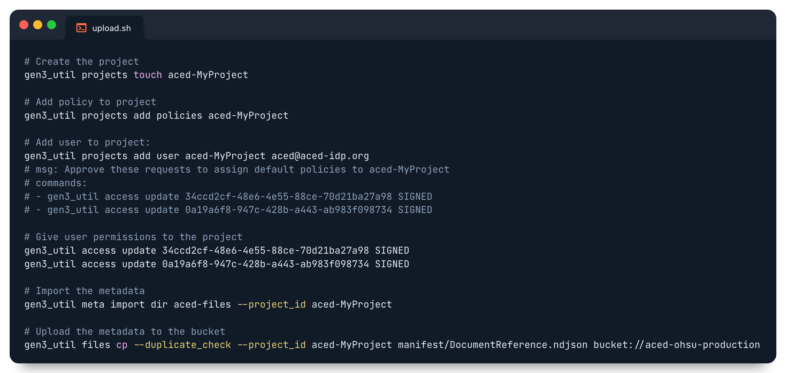

# ACED File Upload

## Requirements

- [gen3_util](https://github.com/ACED-IDP/gen3_util): Utilities to manage Gen3 schemas, projects and submissions.


The upload steps below use the following example values for the name of project, the e-mail account used to log in to the data commons, and directory containing the files to upload:

- Project name: **MyProject**
- E-mail: **aced@aced-idp.org**
- Data directory: **aced-files**

Please substitute these values with your own when running the upload steps.

## Upload Steps

1. Create the project
    ```sh
    gen3_util projects touch aced-MyProject
    ```

2. Add policy to project

    ```sh
    gen3_util projects add policies aced-MyProject
    ```

3. Add user to project:

    ```sh
    gen3_util projects add user aced-MyProject aced@aced-idp.org
    # msg: Approve these requests to assign default policies to aced-MyProject
    # commands:
    # - gen3_util access update 34ccd2cf-48e6-4e55-88ce-70d21ba27a98 SIGNED
    # - gen3_util access update 0a19a6f8-947c-428b-a443-ab983f098734 SIGNED
    ```

4. Give user permissions to the project

    ```sh
    gen3_util access update 34ccd2cf-48e6-4e55-88ce-70d21ba27a98 SIGNED
    gen3_util access update 0a19a6f8-947c-428b-a443-ab983f098734 SIGNED
    ```

5. Import the metadata

    ```sh
    gen3_util meta import dir ./aced-files --project_id aced-MyProject
    ```

6. Upload the metadata to the the bucket

    ```sh
    gen3_util files cp --duplicate_check --project_id aced-MyProject manifest/DocumentReference.ndjson bucket://aced-ohsu-production
    ```



