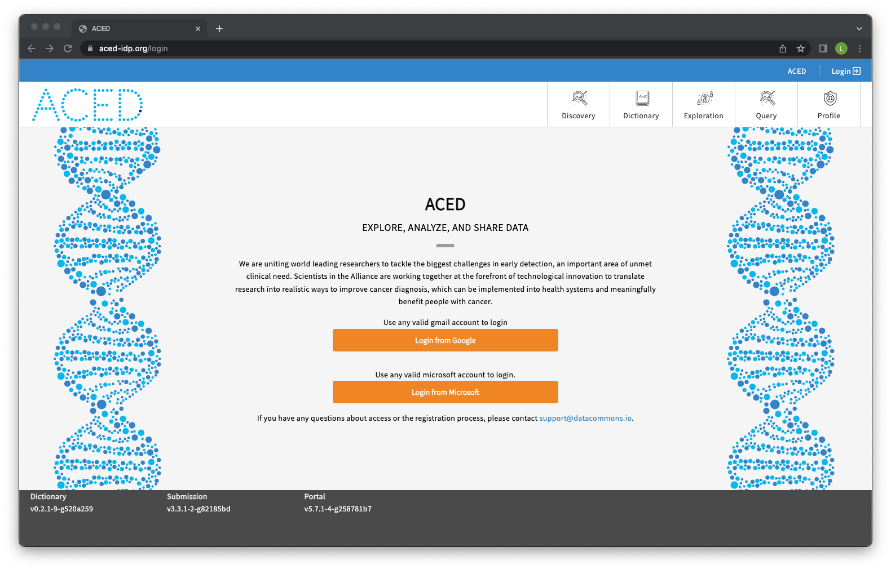
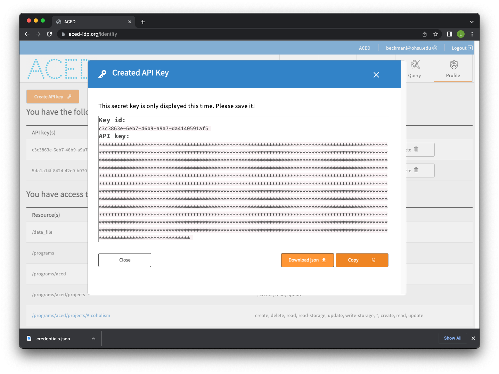
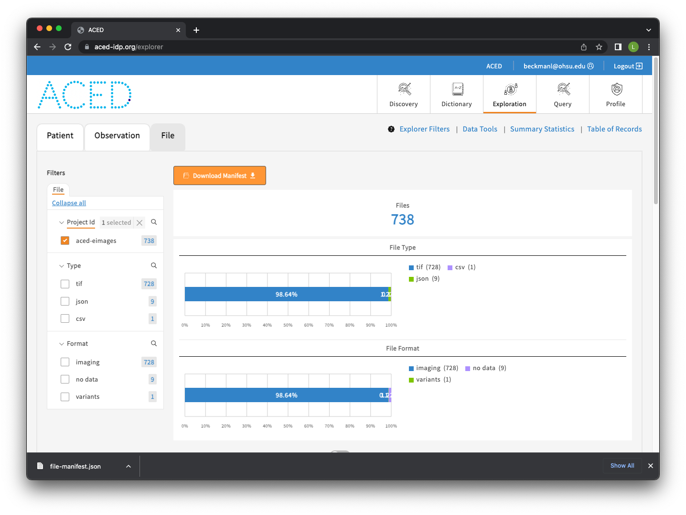
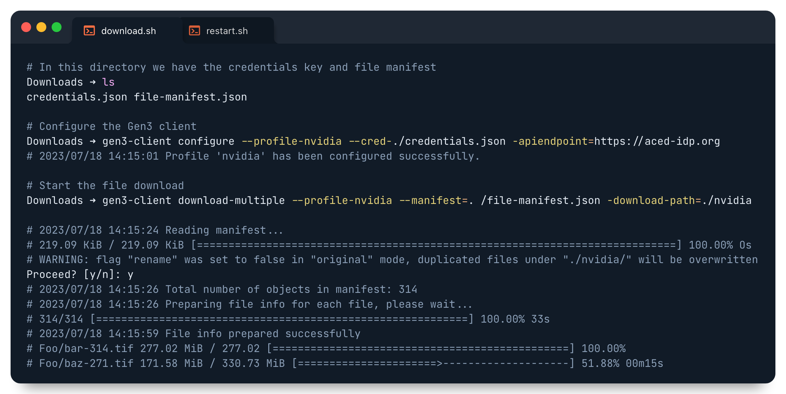
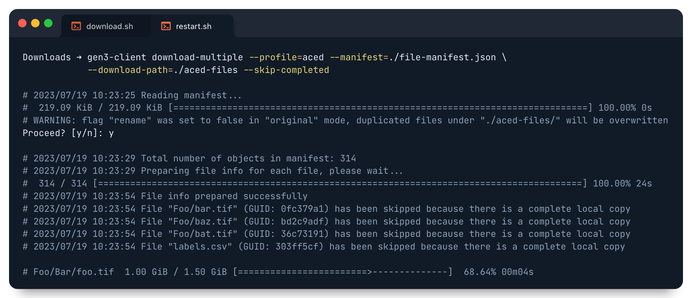

# ACED File Download

## Download Steps

1. Navigate to the [ACED data commons](https://aced-idp.org/)

2. Log in with your credentials through either the 'Login from Google' or the 'Login from Microsoft' buttons.

    

3. Navigate to the [Profile page](https://aced-idp.org/identity) 

4. Create a credentials.json file by selecting 'Create API key' > 'Download json'

    In this example we'll download the credentials file to our Downloads directory (~/Downloads).

    

5. Navigate to the [Explorer page](https://aced-idp.org/explorer)

6. Select the File tab

7. Choose the aced-eimages project in the sidebar

8. Click the 'Download Manifest' button to begin the manifest generation

    

9. Install the gen3-client

    Adapted from the installation instructions page for macOS, Windows, and Linux on the [Gen3 Resources page](https://gen3.org/resources/user/gen3-client/#1-installation-instructions):

    1. Download the latest Mac OS X or Linux version of the gen3-client [here](https://github.com/uc-cdis/cdis-data-client/releases/latest).
    2. Unzip the archive.
    3. Add the unzipped executable to a directory, for example: `~/.gen3/gen3-client.exe`.
    4. Open a terminal window.
    5. Add the directory containing the executable to your Path environment variable by entering this command in the terminal: `echo 'export PATH=$PATH:~/.gen3' >> ~/.bash_profile`.
    6. Run `source ~/.bash_profile` or restart your terminal.
    7. Now you can execute the program by opening a terminal window and entering the command `gen3-client`.

    **Note**: If your Mac OS X does not allow access, you need to manually allow it under System Preferences > Security & Privacy > General (click the lock icon to unlock, enter administrator name and password).

10. Configure the gen3-client

        # This step uses the credentials.json file we downloaded earlier in Step 4
        gen3-client configure --profile=aced --cred=./credentials.json --apiendpoint=https://aced-idp.org

11. Start the download

        # This step will download all files to the ./aced-files directory
        gen3-client download-multiple --profile=aced --manifest=./file-manifest.json --download-path=./aced-files

    

<!-- Terminal image source: -->
<!-- https://app.codeimage.dev/d1c80a2d-cded-432e-9d2e-825a0e058996 -->

## Restarting the Download

If the download is interrupted the `--skip-completed` flag can be appended to the gen3-client command in order to restart the download while skipping any previously download files. More specifically it skips any file in the download directory that has the same filename and size as that in the file manifest.

    # Prevent downloading existing files with the '--skip-completed' flag
    gen3-client download-multiple --profile=<PROFILE NAME> --manifest=./file-manifest.json --download-path=./gen3-files --skip-completed

