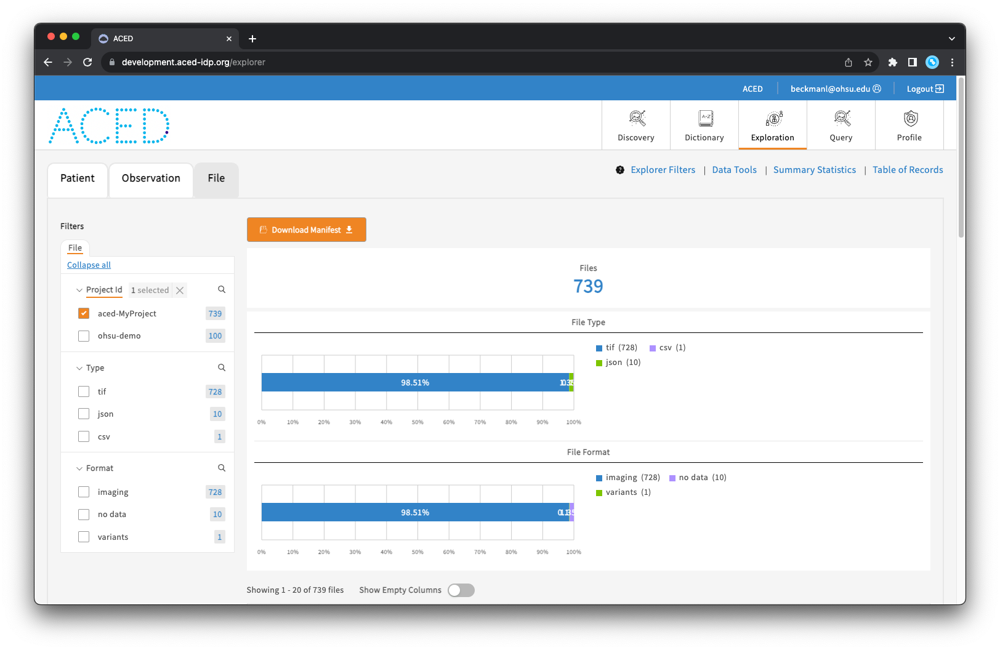
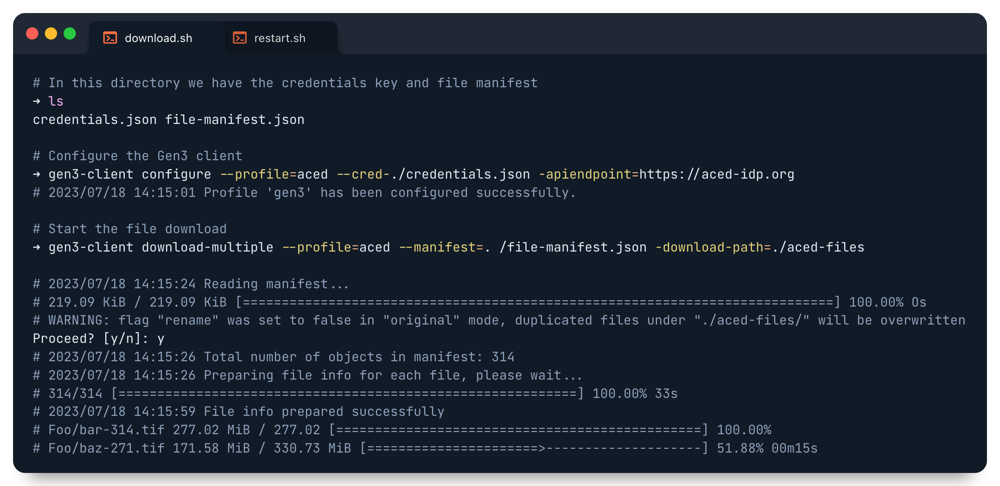
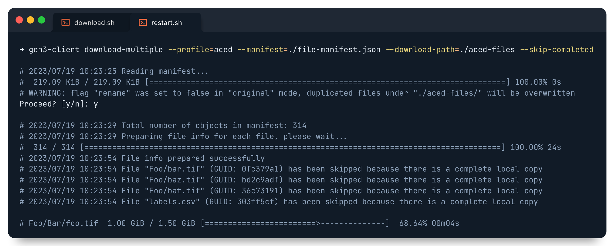

# ACED File Download

## Requirements

- [gen3-client](https://github.com/uc-cdis/cdis-data-client) — Data access client 

### Installing the Requirements

To install the gen3-client, follow the steps adapted from the [Gen3 Resources page](https://gen3.org/resources/user/gen3-client/#1-installation-instructions):

1. Download the latest version of the gen3-client [here](https://github.com/uc-cdis/cdis-data-client/releases/latest).
2. Unzip the archive.
3. Add the unzipped executable to a directory, for example: `~/.gen3/gen3-client.exe`.
4. Add the directory containing the executable to your Path environment variable by entering this command in the terminal: `echo 'export PATH=$PATH:~/.gen3' >> ~/.bash_profile`.
5. Run `source ~/.bash_profile` or restart your terminal.
6. Now you can execute the program by opening a terminal window and entering the command `gen3-client`.

**Note**: If your macOS does not allow access, you need to manually allow it under System Preferences > Security & Privacy > General (click the lock icon to unlock, enter administrator name and password).


## Download Steps

The download steps below use the following example values for the name of project and directory to which files will be downloaded:

- Project name: **aced-MyProject**
- Data directory: **aced-files**

Please substitute these values with your own when running the upload steps.

1. Navigate to the [ACED data commons](https://aced-idp.org/)

2. Log in with your credentials through either the 'Login from Google' or the 'Login from Microsoft' buttons.

    

3. Navigate to the [Profile page](https://aced-idp.org/identity) 

4. Create a credentials.json file by selecting 'Create API key' > 'Download json'

    In this example the credentials file is downloaded to the Downloads directory (`~/Downloads`).

    

5. Navigate to the [Explorer page](https://aced-idp.org/explorer)

6. Select the File tab

7. Choose the desired project in the sidebar (e.g. aced-MyProject)

8. Click the 'Download Manifest' button to begin the manifest generation

    

9. Configure the gen3-client with the credentials.json file downloaded in Step 4. This step is only required the first time the gen3-client is used (the configuration here will be used for any future downloads).

    ```sh
    gen3-client configure --profile=aced --cred=./credentials.json --apiendpoint=https://aced-idp.org
    ```

10. Download the files to the desired directory (e.g. `./aced-files`)

    ```sh
    gen3-client download-multiple --profile=aced --manifest=./file-manifest.json --download-path=./aced-files
    ```

    

<!-- Terminal image source: -->
<!-- https://app.codeimage.dev/d1c80a2d-cded-432e-9d2e-825a0e058996 -->

## Restarting the Download

If the download is interrupted the `--skip-completed` flag can be appended to the gen3-client command in order to restart the download while skipping any previously download files. More specifically it skips any file in the download directory that has the same filename and size as that in the file manifest.

    # Prevent downloading existing files with the '--skip-completed' flag
    gen3-client download-multiple --profile=<PROFILE NAME> --manifest=./file-manifest.json --download-path=./gen3-files --skip-completed


