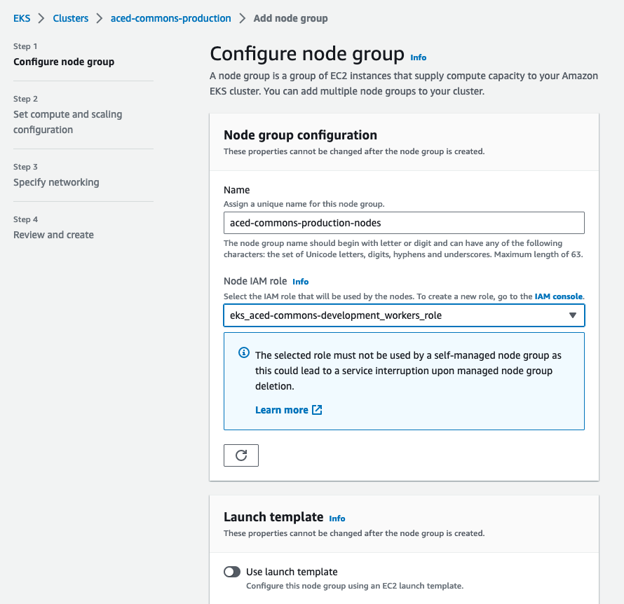

# AWS Setup

## EKS Node Group

<https://us-west-2.console.aws.amazon.com/eks/home?region=us-west-2#/clusters/aced-commons-production>

Compute > Add node group



### Node group configuration

Name
`aced-commons-production-nodes`

Node IAM role
`eks_aced-commons-production_workers_role`

### Node group compute configuration

AMI type
`Amazon Linux 2 (AL2_x86_64)`

Capacity type
`On-Demand`

Instance types
`t3.xlarge`

Disk size
`20 GB`

### Node group scaling configuration

Desired size
`2`

Minimum size
`2`

Maximum size
`4`

### Node group update configuration

Maximum unavailable
`1`

### Node group network configuration

Subnets
`eks_public_0`
`eks_public_1`
`eks_public_2`

Configure remote access to nodes
`Enable`

EC2 Key Pair
`aced-commons-production_automation_dev`

Allow remote access from
`All`

## ETL Node Group

Create a new node group with 100GB of storage for use by the ETL pod and update the `nodeSelector` value in the ETL yaml file:

```yaml
nodeSelector:
  eks.amazonaws.com/nodegroup: aced-commons-development-etl-node-group
```

The ETL pod should not be ready for deployment!

Note: if the node or nodes in a given node group do not have egress or network access then the `kubectl coredon` command can be used to disable the node group in order to prevent scheduling nodes to that group.

## RDS (Aurora)

<https://us-west-2.console.aws.amazon.com/rds/home?region=us-west-2#>


### Engine options

`Show versions that support Serverless v2`

Aurora PostgreSQL (Compatible with PostgreSQL 14.6)

### Templates
Production

### Settings

DB cluster identifier
aced-commons-development-aurora

Manage master credentials in AWS Secrets Manager

### Settings

DB cluster identifier
aced-commons-development-aurora

Manage master credentials in AWS Secrets Manager

### Instance configuration

DB instance class
`Serverless v2`

Minimum ACUs
`0.5 (1 GiB)`

Maximum ACUs
`10 (20 GiB)`

### Availability & durability

Create an Aurora Replica or Reader node in a different AZ (recommended for scaled availability)
Creates an Aurora Replica for fast failover and high availability.

### Connectivity

Don’t connect to an EC2 compute resource

Virtual private cloud (VPC)
`aced-commons-development`

Public Access
`No`

VPC security group (firewall)
`Choose Existing`

Existing VPC security groups
`Local`, `Default`

### Database authentication

IAM database authentication

### Additional Configuration

Backup retention period
`14 days`

Target Backtrack window
`48 hours`

Log exports
Select the log types to publish to Amazon CloudWatch Logs
`PostgreSQL log`

Log exports
- `Audit log`
- `Error log`
- `General log`
- `Slow query log`

Deletion protection
`Enable`

---

Add to `values.yaml`:

```yaml
global:
  # RDS configuration
  postgres:
    master:
      # Writer instance endpoint
      host: "foo-aurora.rds.amazonaws.com"
      username: <POSTGRES USERNAME>
      password: <POSTGRES PASSWORD>
      port: 5432
```

## ElasticSearch (OpenSearch)

```json
{
    "DomainName": "aced-commons-development-es",
    "AdvancedSecurityOptions": {
        "MasterUserOptions": {
            "MasterUserName": "<MASTER USERNAME>",
            // echo "$(openssl rand -base64 12)_Ek1$" >> es_domain.json
            "MasterUserPassword": "<MASTER USER PASSWORD>"
        }
    },
    "VPCOptions": {
      // int_services
      "SubnetIds": ["subnet-foo"],
      // aced-commons-development-local-sec-group
      "SecurityGroupIds": ["sg-foo"] 
    }
}
```

```sh
aws opensearch create-domain --cli-input-json file://es_domain.json
```

---

Add to `values.yaml`:

```yaml
# OpenSearch configuration
aws-es-proxy:
  enabled: true
  # Endpoint
  esEndpoint: vpc-foo.es.amazonaws.com
  secrets:
    awsAccessKeyId: "<ACCESS KEY ID>"
    awsSecretAccessKey: "<SECRET ACCESS KEY>"
```

## Bucket setup

> Unlike our compose services environment, where docker-compose was responsible for Gen3 and S3 (minio) configurations,  our k8s environment only has responsibility for Gen3 services and dependencies.   S3, whether AWS or Minio based is handled externally.

### Current staging setup

* OHSU - minio setup documented [here](https://ohsuitg-my.sharepoint.com/:t:/r/personal/walsbr_ohsu_edu/Documents/aced-1-minio.md?csf=1&web=1&e=iL5PmW)

* ucl, manchester, stanford

  * create buckets
  

  * grant permissions to a AWS IAM user representing fence.
  

  * see fence-config.yaml:
     * `AWS_CREDENTIALS: {}`  aws_access_key_id, aws_secret_access_key
     * `S3_BUCKETS: {}`  bucket_name, cred, region


- Cloud Automation automatically creates four buckets:
  - aced-commons-staging-data-bucket	
  - aced-commons-staging-data-bucket-logs	
  - kube-aced-commons-staging-gen3	
  - logs-aced-commons-staging-gen3

This buckets serve as a template for our storage buckets but won't actually be used to store data. Instead we'll manually create five buckets that represent the data storage for each institution:
  - aced-production-data-bucket
  - aced-production-manchester-data-bucket
  - aced-production-ohsu-data-bucket
  - aced-production-stanford-data-bucket
  - aced-production-ucl-data-bucket

## Certificate

Creating a [certificate in AWS](https://us-west-2.console.aws.amazon.com/acm/home?region=us-west-2#/certificates/list) requires DNS validation through the domain registrar (e.g. Google Domains). For our purposes we'll create a certificate that has the following domain names:
- `aced-idp.org`
- `*.aced-idp.org`

## Install Load Balancer Controller

https://docs.aws.amazon.com/eks/latest/userguide/aws-load-balancer-controller.html

```sh
curl -O https://raw.githubusercontent.com/kubernetes-sigs/aws-load-balancer-controller/v2.4.7/docs/install/iam_policy.json

aws iam create-policy \
    --policy-name aced-commons-production-AWSLoadBalancerControllerIAMPolicy  \
    --policy-document file://iam_policy.json

eksctl create iamserviceaccount \
  --cluster=aced-commons-production \
  --namespace=kube-system \
  --name=aws-load-balancer-controller \
  --role-name aced-commons-production-AmazonEKSLoadBalancerControllerRole \
  --attach-policy-arn=arn:aws:iam::119548034047:policy/aced-commons-production-AWSLoadBalancerControllerIAMPolicy \
  --approve --override-existing-serviceaccounts

helm repo add eks https://aws.github.io/eks-charts

helm repo update eks

helm install aws-load-balancer-controller eks/aws-load-balancer-controller \
  -n kube-system \
  --set clusterName=aced-commons-production \
  --set serviceAccount.create=false \
  --set serviceAccount.name=aws-load-balancer-controller

kubectl get deployment -n kube-system aws-load-balancer-controller
# NAME                           READY   UP-TO-DATE   AVAILABLE   AGE
# aws-load-balancer-controller   2/2     2            2           84s
```

## Deploy with Helm

```sh
# https://docs.aws.amazon.com/eks/latest/userguide/create-kubeconfig.html
aws eks update-kubeconfig --region us-west-2 --name aced-commons-production

kubectl config get-contexts

helm upgrade --install local ./helm/gen3 -f Secrets/values.yaml -f Secrets/user.yaml -f Secrets/fence-config.yaml

kc get pods

kc get ingress
```

# Troubleshooting

## No network connection between pods or from pods to the outside network

Commands like curl revproxy-service failing or commands like apt update and ping 8.8.8.8 hanging.

Restart the CoreDNS service within the kube-system namespace 

```sh
kubectl rollout restart -n kube-system deployment/coredns
```
