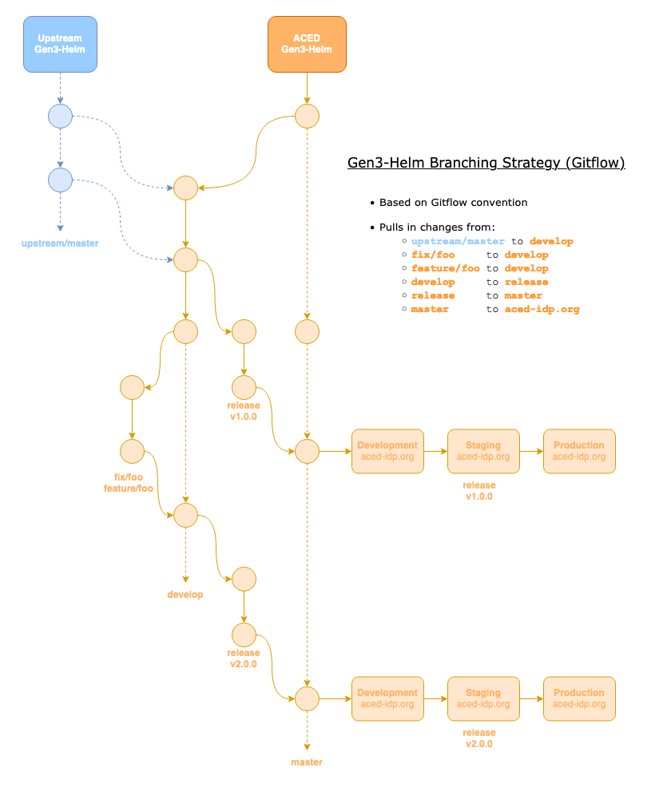

# Managing the Deployments

Deployment of the commons can be done through the Makefile, with all available commands accessible through the `make help` command:

```sh
➜ make help
update               Update from the local helm chart repository
local                Deploy the Local commons
development          Deploy the Development commons
staging              Deploy the Staging commons
production           Deploy the Production commons
context              Output the current Kubernetes context
clean                Delete all existing deployments, configmaps, and secrets
help                 Show this help message
```

## Deployment Management

### Updating

To update from the local Helm repository (e.g. `./gen3-helm`), run the following:

```sh
➜ make update
Hang tight while we grab the latest from your chart repositories...
Update Complete. ⎈Happy Helming!⎈
```


### Deploying Local

Switch to the Local (Rancher Desktop) kubernetes context:

```sh
kubectl config use-context rancher-desktop
# Switched to context "rancher-desktop".
```

Set the Local Secrets folder:

```sh
➜ trash Secrets # Moves Secrets folder to trash, alternativt to 'rm -rf Secrets'
➜ ln -s Secrets.local Secrets
```

Deploy the Local site:

```sh
➜ make local
Deploy local? [y/N]: y
Deploying local
Release "local" has been upgraded. Happy Helming!
```

### Deploying Development

Switch to the Development kubernetes context:

```sh
➜ kubectl config use-context arn:aws:eks:us-west-2:119548034047:cluster/aced-commons-development
Switched to context "arn:aws:eks:us-west-2:119548034047:cluster/aced-commons-development".
```

Set the Development Secrets folder:

```sh
➜ trash Secrets # Moves Secrets folder to trash, alternativt to 'rm -rf Secrets'
➜ ln -s Secrets.development Secrets
```

Deploy the Development site:

```sh
➜ make development
Deploy development? [y/N]: y
Deploying development
Release "development" has been upgraded. Happy Helming!
```

### Deploying Staging

Switch to the Staging kubernetes context:

```sh
➜ kubectl config use-context arn:aws:eks:us-west-2:119548034047:cluster/aced-commons-staging
Switched to context "arn:aws:eks:us-west-2:119548034047:cluster/aced-commons-staging".
```

Set the Staging Secrets folder:

```sh
➜ trash Secrets # Moves Secrets folder to trash, alternativt to 'rm -rf Secrets'
➜ ln -s Secrets.staging Secrets
```

Deploy the Staging site:

```sh
➜ make staging
Deploy staging? [y/N]: y
Deploying staging
Release "staging" has been upgraded. Happy Helming!
```

### Deploying Production

Switch to the Production kubernetes context:

```sh
➜ kubectl config use-context arn:aws:eks:us-west-2:119548034047:cluster/aced-commons-production
Switched to context "arn:aws:eks:us-west-2:119548034047:cluster/aced-commons-production".
```

Set the Production Secrets folder:

```sh
➜ trash Secrets # Moves Secrets folder to trash, alternativt to 'rm -rf Secrets'
➜ ln -s Secrets.production Secrets
```

Deploy the Production site:

```sh
➜ make production
Deploy production? [y/N]: y
Deploying production
Release "production" has been upgraded. Happy Helming!
```

### Cleaning

To uninstall the deployment and remove all secrets and configmaps from the current context run the `make clean` command:

```sh
➜ make clean
Uninstall local? [y/N]: y
Uninstalling local
```

## Pod Management

### Listing Pods

To list all pods run the `kubectl get pods` command:

```sh
➜ kubectl get pods
NAME                                              READY   STATUS
argo-wrapper-deployment-69464b4fc6-p86l8          1/1     Running
revproxy-deployment-cb7c544bc-lns6g               1/1     Running
local-postgresql-0                                1/1     Running
...
```

### Describing Pods

To get more info from a pod run the `kubectl describe` command (especially helpful for debugging failing pods):

```sh
➜ kubectl describe deployment/portal-deployment
Name:                   portal-deployment
Namespace:              default
...
```

### Logging Pods

To output the logs of a running pod run the `kubectl logs` command:

```sh
➜ kubectl logs deployment/portal-deployment -f
APP="${APP:-dev}"

if [ -f custom/favicon/$APP-favicon.ico ]; then
  cp custom/favicon/$APP-favicon.ico src/img/favicon.ico
fi
...
```

### Execing Into Pods

To exec into a running pod run the `kubectl exec` command. For instance to exec into the Portal pod we'd run the following:

```sh
➜ kubectl exec --stdin --tty deployment/portal-deployment -- /bin/bash
root@portal-deployment-<POD ID>:/data-portal# exit
```

### Restarting Pods

To restart a pod run the `kubectl rollout restart` command:

```sh
➜ kubectl rollout restart deployment/portal-deployment
```

## Listing Contexts

To list the current kubernetes context run the `kubectl config current-context` command:

```sh
➜ kubectl config current-context
rancher-desktop
```

To list the all available kubernetes contexts run the `kubectl config get-contexts` command:

```sh
➜ kubectl config get-contexts
CURRENT   NAME
          arn:aws:eks:us-west-2:119548034047:cluster/aced-commons-development
          arn:aws:eks:us-west-2:119548034047:cluster/aced-commons-production
          arn:aws:eks:us-west-2:119548034047:cluster/aced-commons-staging
*         rancher-desktop
```

## Branching Strategy

The typical flow for deployments and testing follows a [Gitflow-like](https://www.atlassian.com/git/tutorials/comparing-workflows/gitflow-workflow) pattern outlined below, whereby:

- the `devlop` branch serves as the base for feature and bug fixes (rebased onto `upstream/master` periodically)
- the `release` branch serves as the base for final release testing before merging into `master`
- the `master` branch contains deployments that are ready for release into the development → staging → production pipeline



## Future Plans

- Automate the switching of contexts and Secrets folders in the single `make command`:

    Current method:
    ```sh
    ➜ kubectl config use-context rancher-desktop
    ➜ trash Secrets
    ➜ ln -s Secrets.local Secrets
    ➜ make local
    Deploying local
    Release "local" has been upgraded. Happy Helming!
    ```

    Proposed method:
    ```sh
    ➜ make local # Handles context switch and Secrets folder automatically
    Deploying local
    Release "local" has been upgraded. Happy Helming!
    ```

- Add a `make release` target that would create a new `release` branch off `devlop`, somewhat similar to Funnel's strategy
- Add tests for Helm charts to be invoked during the development/release process (e.g. `make test`)
