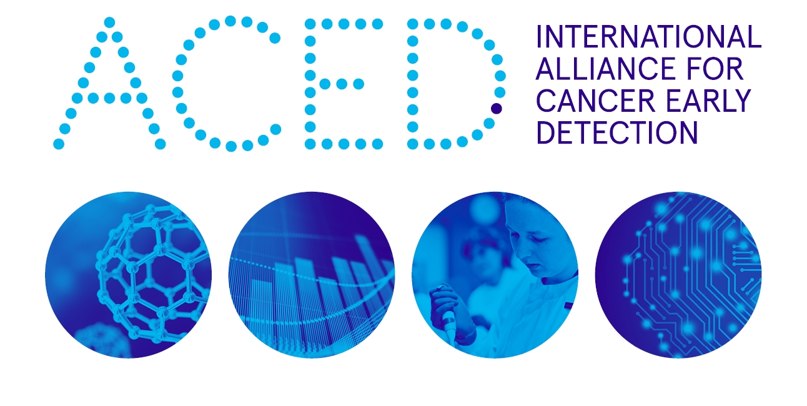

# Welcome to the ACED-IDP Documentation

This is the documentation for the [ACED-IDP Data Commons](https://aced-idp.org), serving the [International Alliance for Cancer Early Detection](https://www.cancerresearchuk.org/funding-for-researchers/research-opportunities-in-early-detection-and-diagnosis/international-alliance-for-cancer-early-detection)

> The International Alliance for Cancer Early Detection (ACED) is a new £55 million partnership between Cancer Research UK, the Canary Center at Stanford University, the University of Cambridge, the Knight Cancer Institute at OHSU, University College London and the University of Manchester.

> We are uniting world leading researchers to tackle the biggest challenges in early detection, an important area of unmet clinical need. Scientists in the Alliance are working together at the forefront of technological innovation to translate research into realistic ways to improve cancer diagnosis, which can be implemented into health systems and meaningfully benefit people with cancer.

## Getting Started

Please see the [Getting Started](./getting-started.md) page for instructions on how to installing the required tools needed to create a project, add authorized users, and upload and download files.

