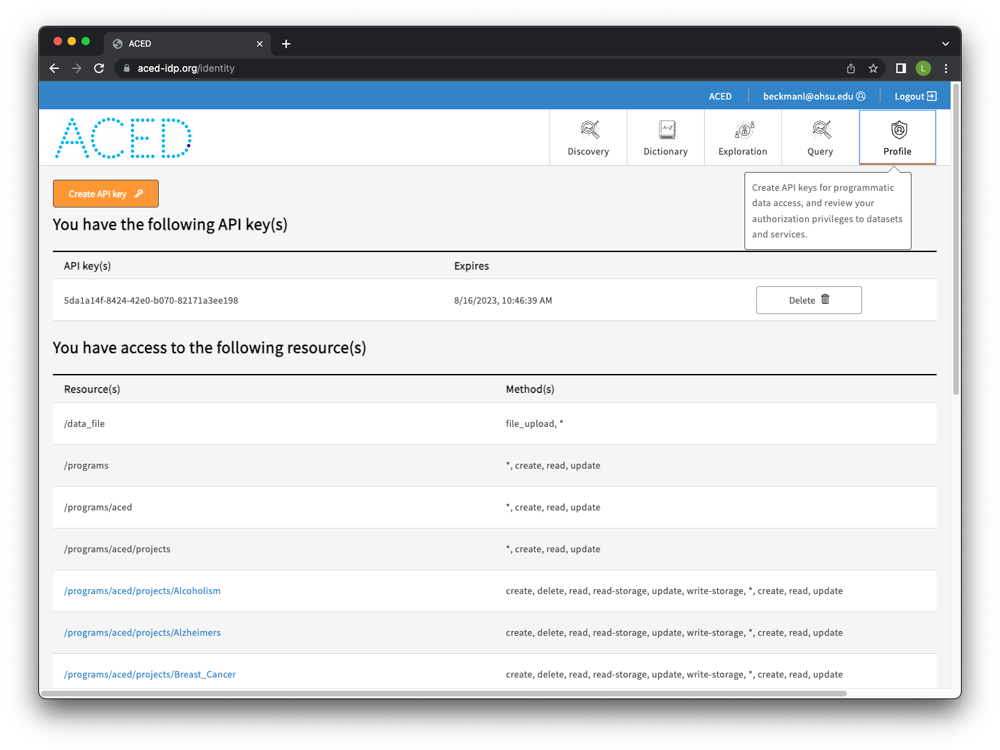
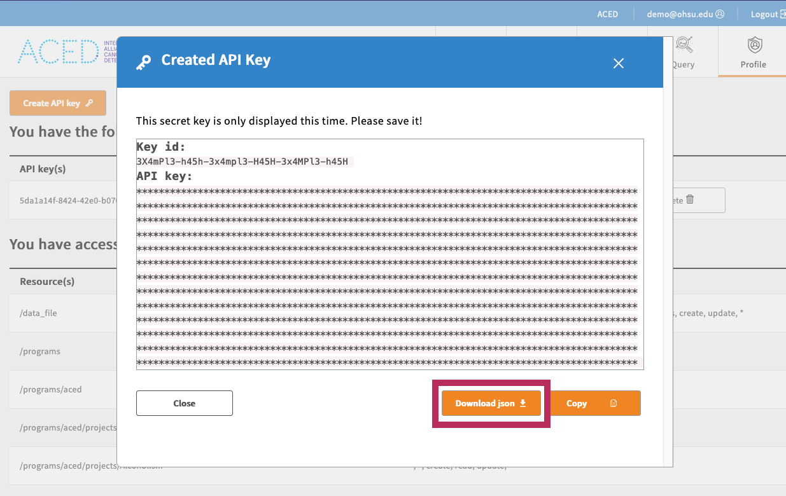

# Requirements

## 1. Download gen3-client

=== "macOS"
    1. Download the [latest](https://github.com/uc-cdis/cdis-data-client/releases) macOS version.
    2. Follow the instructions in the installer
    3. Open a terminal window.
    4. Move the executable to the default directory: `mv /Applications/gen3-client ~/.gen3/gen3-client`
    5. Add the directory containing the executable to your Path environment variable by entering this command in the terminal: `echo 'export PATH=$PATH:~/.gen3' >> ~/.bash_profile`
    6. Run `source ~/.bash_profile` or restart your terminal.
    7. Now you can execute the program by opening a terminal window and entering the command `gen3-client`


=== "Linux"
    1. Download the [latest](https://github.com/uc-cdis/cdis-data-client/releases) Linux version of the gen3-client.
    2. Unzip the archive.
    3. Add the unzipped executable to a directory, for example: `~/.gen3/gen3-client`
    4. Open a terminal window.
    5. Add the directory containing the executable to your Path environment variable by entering this command in the terminal: `echo 'export PATH=$PATH:~/.gen3' >> ~/.bash_profile`
    6. Run `source ~/.bash_profile` or restart your terminal.
    7. Now you can execute the program by opening a terminal window and entering the command `gen3-client`

=== "Windows"
    1. Download the [latest](https://github.com/uc-cdis/cdis-data-client/releases) Windows version of the gen3-client.
    2. Unzip the archive.
    3. Add the unzipped executable to a directory, for example: `C:\Program Files\gen3-client\gen3-client.exe`
    4. Open the Start Menu and type "edit environment variables".
    5. Open the option "Edit the system environment variables".
    6. In the "System Properties" window that opens up, on the "Advanced" tab, click on the "Environment Variables" button.
    7. In the box labeled "System Variables", find the "Path" variable and click "Edit".
    8. In the window that pops up, click "New".
    9. Type in the full directory path of the executable file, for example: `C:\Program Files\gen3-client`
    10. Click "Ok" on all the open windows and restart the command prompt if it is already open by entering cmd into the start menu and hitting enter.

## 2. Configure a gen3-client Profile with Credentials

To use the gen3-client, you need to configure  `gen3-client` with API credentials downloaded from the [Profile page](https://aced-idp.org/Profile).



Download the access key from the portal and save it in the standard location `~/.gen3/credentials.json`



From the command line, run the gen3-client configure command:

```sh
gen3-client configure --profile=<profile_name> --cred=<credentials.json> --apiendpoint=https://aced-idp.org

# Mac/Linux Example:
gen3-client configure --profile=demo --cred=~/Downloads/credentials.json --apiendpoint=https://aced-idp.org

# Windows Example:
gen3-client configure --profile=demo --cred=C:\Users\demo\Downloads\credentials.json --apiendpoint=https://aced-idp.org
```

Run the `gen3-client auth` command to confirm you configured a profile with the correct authorization privileges. Then, to list your access privileges for each project in the commons you have access to:

```sh
gen3-client auth --profile=aced

# 2023/12/05 15:07:12
# You have access to the following resource(s) at https://aced-idp.org:
# 2023/12/05 15:07:12 /programs/aced/projects/myproject...
```

## 3. Install gen3-tracker (g3t)

The `gen3-tracker (g3t)` tool requires a working [Python 3](https://www.python.org/downloads/) installation no older than [Python 3.12](https://www.python.org/downloads/release/python-3120/). Run the following in your working directory to install the latest version of g3t from the Python Package Index:

```sh
# Optionally create a virtual environment
python3 -m venv venv; source venv/bin/activate

pip install gen3-tracker
```

You can verify the installation was successful by then running the `g3t` command with the expected output being the [latest version](https://pypi.org/project/gen3-tracker/#history):

```sh
g3t --version
```

### Upgrading g3t

This version should match the latest version on the [PyPi page](https://pypi.org/project/gen3-tracker/). If it is out of date, run the following to upgrade your local version:

```sh
pip install -U gen3-tracker
```

### Configuration

g3t uses the [gen3-client](https://gen3.org/resources/user/gen3-client/#2-configure-a-profile-with-credentials) configuration flow.

After configuration, you can either specify the `--profile` or set the `G3T_PROFILE=profile-name` environmental variable.

### Testing the configuration

The command `g3t ping` will confirm that the access key and gen3-client have been configured correctly

```sh
g3t ping

msg: 'Configuration OK: Connected using profile:production'
endpoint: https://aced-idp.org
username: someone@example.com
```

Now that gen3-client and gen3-tracker are set up, see the [Quickstart Guide](/workflows/quick-start-guide) for how to upload data to a project.