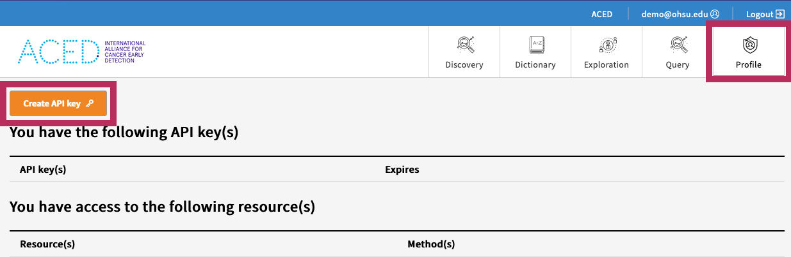



!!! warning
    It is important to use the `gen3-client` from the [ACED Github Release Page](https://github.com/ACED-IDP/cdis-data-client/releases), as it includes several updates from the "upstream" version including support for the `--bucket` flag as well as multipart uploads.

!!! note
    This page is adapted from the ['Download and Upload Files Using the Gen3-client'](https://gen3.org/resources/user/gen3-client/) page from the main [Gen3 website](https://gen3.org/). This site has a wealth of information that supplements the ACED-IDP project including in-depth examples and usages of the gen3-client.

## Downloading gen3-client

A binary executable of the latest version of the gen3-client should be downloaded from the following Table or from the [Release page on Github](https://github.com/ACED-IDP/cdis-data-client/releases). Choose the file that matches your operating system (Windows, Linux, or macOS).

No installation is necessary. Simply download the correct version for your operating system and unzip the archive. The program is then executed from the command-line by running the command gen3-client <options>. For more detailed instructions, see the section below for your operating system.

| Operating System      | Gen3 Client                              | Checksum                   |
| --------------------- | ---------------------------------------- | -------------------------- |
| macOS (Apple Silicon) | [gen3-client-macos.zip][macos-arm]       | [checksums.txt][checksums] |
| macOS (Intel)         | [gen3-client-macos-intel.zip][macos]     | [checksums.txt][checksums] |
| Linux (amd64)         | [gen3-client-linux-amd64.zip][linux]     | [checksums.txt][checksums] |
| Windows (amd64)       | [gen3-client-windows-amd64.zip][windows] | [checksums.txt][checksums] |

[macos-arm]: https://github.com/ACED-IDP/cdis-data-client/releases/latest/download/gen3-client-macos.zip
[macos]: https://github.com/ACED-IDP/cdis-data-client/releases/latest/download/gen3-client-macos-intel.zip
[linux]: https://github.com/ACED-IDP/cdis-data-client/releases/latest/download/gen3-client-linux-amd64.zip
[windows]: https://github.com/ACED-IDP/cdis-data-client/releases/latest/download/gen3-client-windows-amd64.zip
[checksums]: https://github.com/ACED-IDP/cdis-data-client/releases/latest/download/checksums.txt

!!! warning
    Do not try to run the program by double-clicking on it. Instead, execute the program from within the shell / terminal / command prompt. The program does not provide a graphical user interface (GUI) at this time; so, commands are sent by typing them into the terminal.

### Checksum Verification

In order to verify that the downloaded file can be trusted checksums are provided in [`checksums.txt`][checksums]. See below for examples of how to use this file.

<details>
<summary>Successful Verification</summary>

To verify the integrity of the binaries on macOS run the following command in the same directory as the downloaded file:

```sh
$ shasum -c checksums.txt --ignore-missing
gen3-client-macos.zip: OK
```

If the `shasum` command outputs `OK` than the verification was successful and the executable can be trusted.

</details>

<details>
<summary>Unsuccessful Verification</summary>

Alternatively if the command outputs `FAILED` than the checksum did not match and the binary should not be run.

```sh
$ shasum -c checksums.txt --ignore-missing
gen3-client-macos.zip: FAILED
shasum: WARNING: 1 computed checksum did NOT match
shasum: checksums.txt: no file was verified
```

In such a case please reach out to the contributors for assistance.

</details>

## MacOS / Linux Installation Instructions

1. Download the latest macOS (Apple Silicon or Intel) or Linux version of the gen3-client.
2. Unzip the archive.
3. Add the unzipped executable to a directory, for example: `~/.gen3/gen3-client`
4. Open a terminal window.
5. Add the directory containing the executable to your Path environment variable by entering this command in the terminal: `echo 'export PATH=$PATH:~/.gen3' >> ~/.bash_profile`
6. Run `source ~/.bash_profile` or restart your terminal.
7. Now you can execute the program by opening a terminal window and entering the command `gen3-client`

!!! note
    If your macOS does not allow access, you need to manually allow it under System Preferences > Security & Privacy > General (click the lock icon to unlock, enter administrator name and password).

## Windows Installation Instructions

1. Download the Windows  version of the gen3-client.
2. Unzip the archive.
3. Add the unzipped executable to a directory, for example: `C:\Program Files\gen3-client\gen3-client.exe`
4. Open the Start Menu and type "edit environment variables".
5. Open the option "Edit the system environment variables".
6. In the "System Properties" window that opens up, on the "Advanced" tab, click on the "Environment Variables" button.
7. In the box labeled "System Variables", find the "Path" variable and click "Edit".
8. In the window that pops up, click "New".
9. Type in the full directory path of the executable file, for example: `C:\Program Files\gen3-client`
10. Click "Ok" on all the open windows and restart the command prompt if it is already open by entering cmd into the start menu and hitting enter.

## View the Help Menu

To check that your copy of the client is working and confirm the version, the tool can be run on the command-line in your terminal or command prompt by entering `gen3-client`. Typing this alone or `gen3-client help` will display the help menu. For help on a particular command, enter: `gen3-client <command> help`.

Note that you must provide the full path of the tool in order for the commands to run, for example, `./gen3-client` while working from the directory containing the client. Alternatively, you can add the location of the gen3-client executable to your shell’s PATH environment variable.

## Configure a Profile with Credentials

Before using the gen3-client to upload or download data, the `gen3-client` needs to be configured with API credentials downloaded from the [Profile page](https://aced-idp.org/identity).



Download the access key from the portal and save it in the standard location `~/.gen3/credentials.json`


From the command-line, run the gen3-client configure command with the `--cred`, `--apiendpoint`, and `--profile` flags, for example:

```sh
gen3-client configure --profile=<profile_name> --cred=<credentials.json> --apiendpoint=https://aced-idp.org

# Mac/Linux:
gen3-client configure --profile=demo --cred=~/Downloads/credentials.json --apiendpoint=https://aced-idp.org

# Windows:
gen3-client configure --profile=demo --cred=C:\Users\demo\Downloads\credentials.json --apiendpoint=https://aced-idp.org
```

When successfully executed, this will create a configuration file, which contains all the API keys and URLs associated with each commons profile configured, located in the user folder:

```sh
# Mac/Linux:
/Users/demo/.gen3/gen3_client_config.ini

# Windows:
C:\Users\demo\.gen3\gen3_client_config.ini
```

!!! warning
    These keys must be treated like important passwords; never share the contents of the credentials.json and gen3-client gen3_client_config.ini or config file!

To confirm you successfully configured a profile with the correct authorization privileges, you can run the `gen3-client auth` command, which should list your access privileges for each project in the commons you have access to:

```sh
gen3-client auth --profile=aced

# 2023/12/05 15:07:12
# You have access to the following resource(s) at https://aced-idp.org:
# 2023/12/05 15:07:12 /programs/aced/projects/myproject...
```

## Next steps

- [Install the gen3 tracker](gen3-tracker.md)
