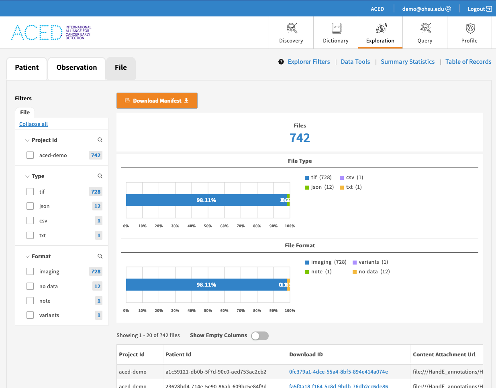

# Creating and Uploading Metadata

### Create Metadata

Create basic, minimal metadata for the project:

```sh
gen3_util meta create /tmp/$PROJECT_ID
# use the --source option to local or remote source data

ls -1 /tmp/$PROJECT_ID
DocumentReference.ndjson
Observation.ndjson
Patient.ndjson
ResearchStudy.ndjson
ResearchSubject.ndjson
Specimen.ndjson
Task.ndjson
```

### Retrieve existing metadata
Retrieve the existing metadata from the portal.

```sh

gen3_util meta pull /tmp/$PROJECT_ID

ls -1 /tmp/$PROJECT_ID
DocumentReference.ndjson
Patient.ndjson
ResearchStudy.ndjson
ResearchSubject.ndjson
Specimen.ndjson

```

### Integrate your data

In your data processing pipeline, flexibility in choosing tools is essential for efficient analysis and interpretation. As bioinformaticians, you're encouraged to use the tools you're most comfortable and proficient with for data manipulation. However, it's important to note that while working with data, all submissions must adhere to the Fast Healthcare Interoperability Resources (FHIR) standards. 

#### Tabular Data Utilities

Currently, the following utilities are undergoing construction and enhancement to optimize their functionalities and performance: 

Convert the FHIR data to tabular form.
This is a local operation that does not require access to the portal.  It uses data downloaded from the portal in the previous step.

```sh
gen3_util meta to_tabular  /tmp/$PROJECT_ID  /tmp/$PROJECT_ID/tabular

```

Convert the tabular data to FHIR.
This is a local operation that does not require access to the portal. p.

```sh
gen3_util meta from_tabular  /tmp/$PROJECT_ID  /tmp/$PROJECT_ID/tabular

```

#### Validate the data

```sh
gen3_util meta validate   /tmp/$PROJECT_ID  

```


### Publish the Metadata

```text
# copy the metadata to the bucket and publish the metadata to the portal
gen3_util meta publish /tmp/$PROJECT_ID
```

## View the Files

This final step uploads the metadata associated with the project and makes the files visible on the [Explorer page](https://aced-idp.org/explorer).

<a href="https://aced-idp.org/explorer"></a>
