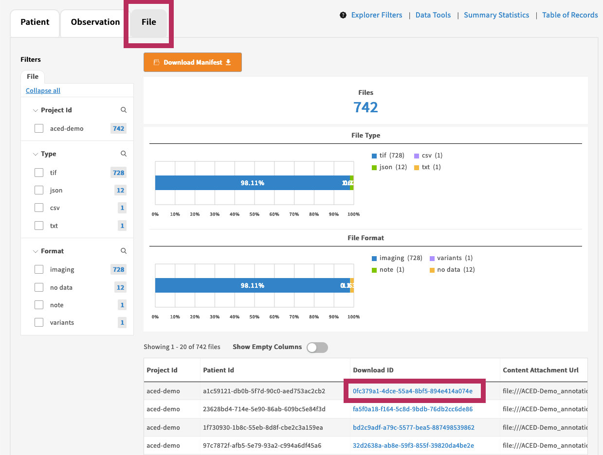
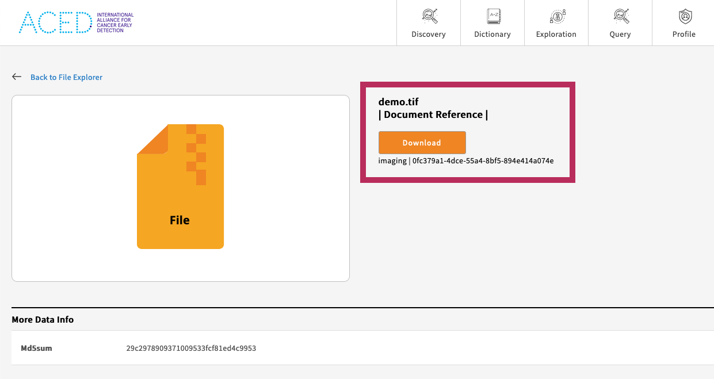
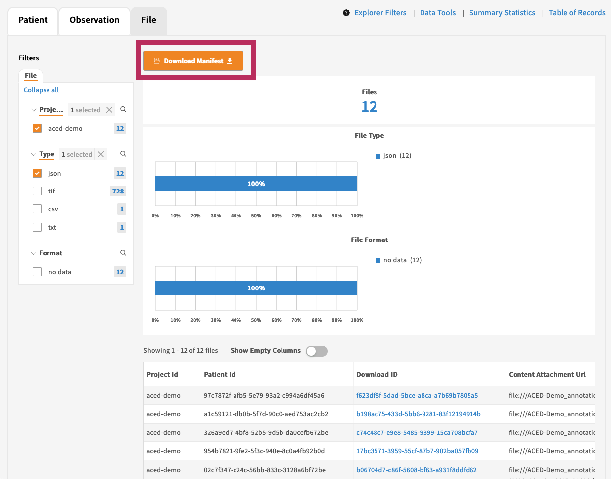



There are two main ways to download files:

1. Individually through the browser or through the command line with the `gen3-client`
2. Batch downloads through the command line with `gen3-client`

This guide will walk you through both methods below.

## Download a Single File

### Explorer Page

The easiest way to download a single file is through the [Explorer page](https://aced-idp.org/Explorer). This page will show all files belonging to projects that you have access to.

To download a single file:

1. Select the **File tab** and scroll down to the list of files
2. Select the **Download ID** for the file of interest

<a href="https://aced-idp.org/Explorer"></a>

3\. Select **Download** on the file page

<a href="https://aced-idp.org/Explorer"></a>

### gen3-client

Alternatively, if you already know the GUID of the file of interest, simply pass it to the gen3-client:

```sh
gen3-client download-single --profile=aced --guid=<GUID>
```

For example, to download the file with GUID `f623df8f-5dad-5bce-a8ca-a7b69b7805a5`:

```sh
gen3-client download-single --profile=aced --guid=f623df8f-5dad-5bce-a8ca-a7b69b7805a5
```

## Download Multiple Files

To download multiple files:

1. Select the **File tab** on the Explorer page
2. Optionally filter by project, data type, and format
3. Select the **Download Manifest** button

<a href="https://aced-idp.org/Explorer"></a>

4\. Download the files by passing the file manifest to the gen3-client:

```sh
gen3-client download-multiple --profile=aced --manifest=file-manifest.json
```

Using the example project in the above screenshot, this command will download all 12 JSON files from the aced-demo project into the current working directory.
