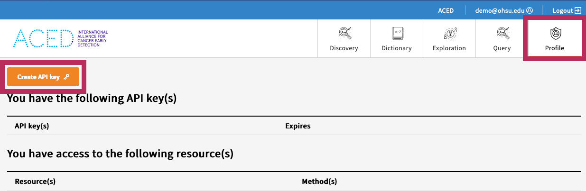

# Data Querying + Gen3 SDK

## Overview ⚙️

Gen3 supports API access to Files and Metadata, allowing users to download and query their data via the Gen3 SDK and GraphQL queries.

## Quick Start ⚡️

*Adapted from the [Gen3 SDK Quick Start page](https://github.com/uc-cdis/gen3sdk-python/blob/master/docs/tutorial/quickStart.md)*

## 1. Dependency and Credentials 


Prior to installing, check a profile credentials. 
Test:
```bash
g3t ping 
```
- will return a list of projects that a profile has access to.

- For new setup or renew of gen3 credentials - Follow steps to configure/re-configure a profile with credentials: 

    - Download an API Key from the [Profile page](https://aced-idp.org/identity) and save it to `~/.gen3/credentials.json`

    

    


## 2. Install

The Gen3 SDK is available for installation via PyPi:

```sh
pip install gen3
```

## 3. Query

The following query examples provide a high-level overview on how to use Gen3 python SDK to authenticate, use the authentication to fetch column/metadata names, retrieve entity ids, and then use the ids to make nested queries. Each project would have a graph schema or definition with relations associated that are defined during data transformation or harmonization. The queries would depend on each project's graph definition traversals.   

### 3.0 Authenticate 

```python
from gen3.auth import Gen3Auth
from gen3.query import Gen3Query

auth = Gen3Auth() 
```
### 3.1 List available fields on an entity to query on


```python
def get_entity_fields(entity_name, auth):
    """Retrieve all field names for a given entity from the Gen3 GraphQL schema."""
    query_template = f"""
    {{
      __type(name: "{entity_name}") {{
        fields {{
          name
        }}
      }}
    }}
    """

    response = Gen3Query.graphql_query(
        Gen3Query(auth),
        query_string=query_template
    )

    if response and response.get("data", {}).get("__type", {}):
        fields = response["data"]["__type"]["fields"]
        field_names = [field["name"] for field in fields]
        return field_names
    else:
        print(f"Failed to retrieve fields for {entity_name}:", response)
        return []

entity_name = "Specimen"  
field_names = get_entity_fields(entity_name, auth)
print(f"Available fields for {entity_name}:", field_names)
```


### 3.2 Filter Patients of Interest (ResearchSubject Participants)

```python
researchsubject_query = """
query ($filter: JSON) {
  researchsubject(filter: $filter, first: 10000) {
            id
            patient_id
            condition_diagnosis
  }
}
"""

researchsubject_variables = {
    "filter": {
        "IN": {
            "condition_diagnosis": ["Infiltrating duct carcinoma, NOS"]
        }
    }
}
researchsubject_response = Gen3Query.graphql_query(
    Gen3Query(auth),
    query_string=researchsubject_query,
    variables=researchsubject_variables
)
patient_ids = [p["patient_id"] for p in researchsubject_response["data"]["researchsubject"]]
```

### 3.3 Filter Specimens of Interest from Patient Ids

```python
def execute_query(auth, query_string, variables=None):
    """perform guppy query"""
    return Gen3Query.graphql_query(Gen3Query(auth), query_string=query_string, variables=variables)

def get_specimens(auth, patient_ids):
    """Fetch specimens associated with patient ids"""
    query = """
    query ($filter: JSON) {
        specimen (filter: $filter, first: 10000) {
            id
            patient_id
            specimen_id
            <other_sample_metadata>
        }
    }
    """
    variables = {"filter": {"IN": {"patient_id": patient_ids}}}
    response = execute_query(auth, query, variables)
    specimens = defaultdict(list)
    for specimen in response["data"]["specimen"]:
        if specimen["gene"]:
            specimens[specimen["patient_id"]].append(specimen)
    return specimens
dat = get_specimens(auth, patient_ids)
specimen_ids = [d[1][0]['id'] for d in dat.items()]
```

### 3.4 Filter Files Associated with Specimens of Interest

```python
def get_files(auth, specimen_ids):
    """Fetch files associated with specimens."""
    query = """
    query ($filter: JSON) {
        file (filter: $filter, first: 10000) {
            id
            specimen_id
            sample_type
        }
    }
    """
    """
    variables = {
    "filter": {
        "AND": [
            {
                "IN": {
                    "specimen_id": specimen_ids
                }
            },
            {
                "LIKE": {
                    "sample_type": ["%Primary Tumor%"]

                }
            }
        ]
    }}
    """
    
    variables = {"filter": {"IN": {"specimen_id": specimen_ids}}}
    response = execute_query(auth, query, variables)
    return response["data"]["file"]

file_data = get_files(auth, specimen_ids)
```

## Simple end to end workflow: 
### Query (`example.graphql`)
```js
query ExampleQuery {
  files: file(first: 1000) {
    file_name
    project_id
    id
  }
  patients: patient(first: 1000) {
    name
    project_id
    id
  }
  observations: observation(first: 1000) {
    code
    project_id
    id
  }
}
```

### Script (`example.py`)
```sh
from gen3.auth import Gen3Auth
from gen3.query import Gen3Query
import json

auth = Gen3Auth()

query = ''

# Read in Example Query
with open('example.graphql') as f:
    query = f.read()

response = Gen3Query.graphql_query(Gen3Query(auth), query_string=query)

formatted = json.dumps(response, indent=2)

print(formatted)

# >>> Example Output
```

### Output

```sh
$ python example.py
{
  "data": {
    "files": [
      {
        "file_name": "example.bam",
        "project_id": "cbds-example",
      },...
    ],
    "patients": [
      {
        "name": "Example Name",
        "project_id": "cbds-example",
      },...
    ],
    "observations": [
      {
        "code": "Example Code",
        "project_id": "cbds-example",
      },...
    ]
  }
}
```

## Additional Resources 📚

- [Gen3 SDK Documentation](https://uc-cdis.github.io/gen3sdk-python/_build/html/index.html)

- [Gen3 SDK Repo](https://github.com/uc-cdis/gen3sdk-python)

- [Gen3 SDK PyPi](https://pypi.org/project/gen3)

- [Guppy Syntax Docs](https://github.com/uc-cdis/guppy/blob/master/doc/queries.md)
